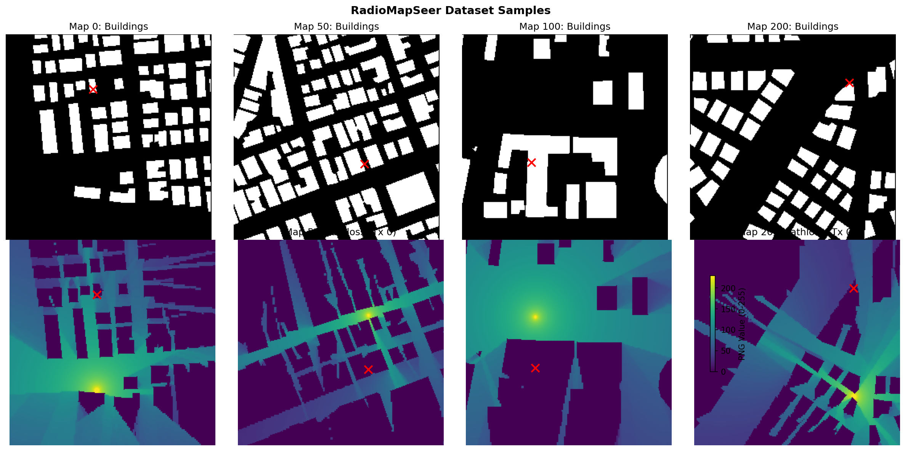

# RadioMapSeer Dataset Documentation

## Overview

**RadioMapSeer** is a pathloss radio map dataset for urban outdoor environments, generated using WinProp ray-tracing software.

## Dataset Structure

```
data/raw/
├── dataset.csv              # Index mapping maps to transmitters
├── antenna/                 # Transmitter positions (JSON)
│   ├── 0.json              # 80 [x,y] coordinates per map
│   └── ...
├── gain/                    # Radio/pathloss maps
│   ├── IRT2/               # Intelligent Ray Tracing (2 interactions) ← RECOMMENDED
│   │   ├── 0_0.png         # {map_id}_{tx_id}.png
│   │   └── ...
│   ├── IRT4/               # 4 interactions (more accurate, slower)
│   ├── DPM/                # Dominant Path Model
│   ├── carsIRT2/           # With cars on roads
│   └── ...
├── png/
│   └── buildings_complete/ # Binary building footprints
│       ├── 0.png
│       └── ...
└── polygon/                # Vector building data (for advanced use)
```

## Verified Specifications

| Property | Value | Notes |
|----------|-------|-------|
| **Building Maps** | 701 files | Binary grayscale (0=building, 255=walkable) |
| **Radio Maps** | 56,080 files | 701 maps × 80 transmitters |
| **Resolution** | 256×256 pixels | 1 meter per pixel |
| **Walkable Ratio** | 34.8% ± 4.4% | Streets, open areas |
| **Transmitters/Map** | 80 | Positioned within [53, 202] pixel range |

## Pathloss Value Encoding

| PNG Value | Pathloss (dB) | Signal Quality |
|-----------|---------------|----------------|
| 0 | -186 dB | Minimum (no signal) |
| 127 | -116.5 dB | Medium |
| 255 | -47 dB | Maximum (near transmitter) |

**Conversion formulas**:
```python
# PNG (0-255) to dB
pathloss_db = (png_value / 255) * 139 + (-186)

# dB to PNG
png_value = int((pathloss_db + 186) / 139 * 255)
```

**Observed statistics** (from IRT2):
- Mean PNG value: ~29 (≈ -170 dB)
- Full range utilized: [0, 255]
- Most values concentrated in low range (weak signals)

## Building Map Encoding

- **Value 0** (Black): Building footprint (obstacle)
- **Value 255** (White): Street/walkable area

This binary encoding is perfect for trajectory generation:
- White pixels = valid walking locations
- Black pixels = obstacles to avoid

## Transmitter Positions

Each `antenna/{map_id}.json` contains 80 [x, y] pixel coordinates:
```json
[[108, 68], [134, 98], [80, 118], ...]
```

Positions are centered (mean ~128) with buffer from edges (min ~53, max ~202).

## Recommended Data Split

| Split | Maps | Samples | Purpose |
|-------|------|---------|---------|
| Train | 490 (70%) | 39,200 | Model training |
| Val | 105 (15%) | 8,400 | Hyperparameter tuning |
| Test | 106 (15%) | 8,480 | Final evaluation |

**Important**: Split by MAP, not by sample, to avoid data leakage.

## Visualization


*Top: Building footprints (white=walkable). Bottom: Pathloss maps (yellow=strong signal near Tx).*


*Pathloss value distribution shows most areas have weak signal (low PNG / high dB loss).*

## Usage Notes

### For Trajectory Sampling
- Use `png/buildings_complete/` for walkable area extraction
- White pixels (255) are valid trajectory points
- Generate A* paths between random walkable points

### For Training
- Use `gain/IRT2/` for pathloss ground truth
- Pair with corresponding building map and antenna positions
- Consider IRT4 for higher fidelity (but slower simulation)

### Key Insight for Our Method
The **binary building maps** naturally define:
- **Walkable areas** (streets) → High trajectory density
- **Buildings** (obstacles) → Zero trajectory samples (blind spots)

This is exactly the trajectory vs. uniform sampling distinction we're modeling.

## Citation

```bibtex
@misc{yapar2022dataset,
  title={Dataset of Pathloss and ToA Radio Maps With Localization Application},
  author={Yapar, Cagkan and Levie, Ron and Kutyniok, Gitta and Caire, Giuseppe},
  year={2022},
  doi={10.21227/0gtx-6v30},
  publisher={IEEE Dataport}
}
```

---

*Analysis completed: 2026-02-03*
